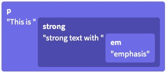
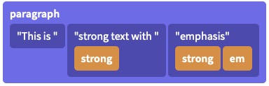
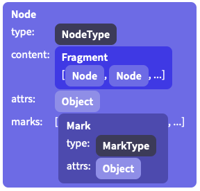

# prosemirror

简介：prosemirror不是一个开箱即用的编辑器，它由多个小的模块组成，类似一个个乐高积木堆叠出的编辑器。

## prosemirror核心库

- `prosemirror-model`: 定义编辑器的文档模型(prosemirror document)，用来描述编辑器内容的数据结构。

- `prosemirror-state`: 提供描述编辑器整个状态的数据结构，包括`selection`，以及从一个状态到下一个状态的`transaction`

- `prosemirror-view`: 在浏览器中将给定编辑器状态显示为可编辑元素，并且处理用户交互的用户界面组件。

- `prosemirror-transform`

## 一个简单的demo

```js
// schema用于规定哪些能包含哪些元素，不包含哪些元素，可以自定义，这里引入一个已经定义好的基础的schema
import {schema} from 'prosemirror-schmea-basic' 
import {EditorState} from 'prosemirror-state'
import {EditorView} from 'prosemirror-view'

// 利用schema创建一个state，该state会生成一个遵守schema约束的空的文档
const state = EditorState.create({schema})

// 最后根据state，生成一个view
const view = new EditorView(document.querySelector('#editor'), {state})
```

## 核心概念

### Documents

prosemirror定义了它自己数据结构来表示document内容，类似虚拟dom？

**虚拟dom**

Prosemirror使用了虚拟dom的方式来表示Documents

Prosemirror的Documents的结构和浏览器的DOM结构相似，都是一样的递归的树状结构。但在存储内联元素时，prosemirror和浏览器dom有点不同

考虑以下html👇

```html
<p>This is <strong>strong text with <em>emphasis</em></strong></p>
```

对应的浏览器dom结构👇



事实上有多种dom结构可以获得和上面一样的效果

```html
<p>This is <strong>strong text with </strong> <strong><em>emphasis</em></strong></p>
```

prosemirror的结构👇



在prosemirror中内联元素的存储被表示为一种扁平的结构，节点标签如`<strong> <b>`作为`metadata`附加到`node`上

这种存储结构带来了一些优点

1. 允许我们使用字符的偏移量而不是一个树节点的路径来表示其所处段位中的位置
2. 使得一些诸如分隔字符串、改变内容样式的操作变得简单
3. 每个document都只有一种数据结构表达方式，相邻的文本节点的相同的marks会被合并在一起(上面相邻的strong)，marks的顺序由`schema`约束

**document数据结构**

一个document的数据结构看起来像这样👇



一个doc实际上就是一个node节点（顶层node），content属性存储子node数组

属性：

- `type`: 由schema创建，可以知道node的名字以及支持的attributes属性
- `content`: nodes数组，存储子节点
- `marks`: 存储类似`<b>`、`<em>`
- `attrs`:

### transactions

当用户与页面的view进行交互时，prosemirror会产生`state transactions`，`transactions`描述了state的变化，这些变化被用来创建一个新的`state`，然后用新的`state`来更新`view`。

可以通过增加`dispatchTransaction prop`的方式，在变化的过程中增加hook👇

```js
let state = EditorState.create({schema})
let view = new EditorView(document.body, {
  state,
  dispatchTransaction(transaction) {
    console.log("Document size went from", transaction.before.content.size,
    "to", transaction.doc.content.size)
    let newState = view.state.apply(transaction)
    view.updateState(newState)
  }
})
```

### schema

schema用于约束document中的node类型，以及节点之间的嵌套关系（规定某些节点中可以包含哪些类型的节点，不可以包含哪些类型的节点）。例如schema可以规定顶级节点可以包含一个或多个blocks.

**node types**

在schmea中，需要为每一个用到的node定义一个type（用一个对象描述type）

例如👇：

```js
const schema = new Schema({
  nodes: {
    doc: {content: "paragraph+"}, // schmea中至少定义一个顶级node的type，顶级node的默认名为doc
    paragraph: {content: "text*"},
    text: {inline: true},
    /* ... and so on */
  }
})
```

上面的schema约束了一个`document`可以包含一个或多个`paragraphs`，一个`paragraph`又可以包含任意数量的`text`

**content expressions**

content属性表示该node可以包含的子元素

content属性值是一个字符串，支持正则表达式

例如：`paragraph+` 至少包含1个或多个`paragraph` `paragraph*` 可以包含0个或多个


